# Practica Docker
## Iván Pérez Fita
### Introducción
Docker es un proyecto de código abierto que automatiza el despliegue de aplicaciones dentro de contenedores de software, proporcionando una capa adicional de abstracción y automatización de virtualización de aplicaciones en múltiples sistemas operativos.​ Docker utiliza características de aislamiento de recursos del kernel Linux, tales como cgroups y espacios de nombres (namespaces) para permitir que "contenedores" independientes se ejecuten dentro de una sola instancia de Linux, evitando la sobrecarga de iniciar y mantener máquinas virtuales.
Con DOCKER, puede usar los contenedores como máquinas virtuales extremadamente livianas y modulares. Además, obtiene flexibilidad con estos contenedores: puede crearlos, implementarlos, copiarlos y moverlos de un entorno a otro, lo cual le permite optimizar sus aplicaciones para la nube.
Ventajas de los contenedores Docker

Modularidad

El enfoque Docker para la creación de contenedores se centra en la capacidad de tomar una parte de una aplicación, para actualizarla o repararla, sin necesidad de tomar la aplicación completa. Además de este enfoque basado en los microservicios, puede compartir procesos entre varias aplicaciones de la misma forma que funciona la arquitectura orientada al servicio (SOA).
Control de versiones de imágenes y capas

Cada archivo de imagen de Docker se compone de una serie de capas. Estas capas se combinan en una sola imagen. Una capa se crea cuando la imagen cambia. Cada vez que un usuario especifica un comando, como ejecutar o copiar, se crea una nueva capa.

Docker reutiliza estas capas para construir nuevos contenedores, lo cual hace mucho más rápido el proceso de construcción. Los cambios intermedios se comparten entre imágenes, mejorando aún más la velocidad, el tamaño y la eficiencia. El control de versiones es inherente a la creación de capas. Cada vez que se produce un cambio nuevo, básicamente, usted tiene un registro de cambios incorporado: control completo de sus imágenes de contenedor.
Restauración

Probablemente la mejor parte de la creación de capas es la capacidad de restaurar. Toda imagen tiene capas. ¿No le gusta la iteración actual de una imagen? Restáurela a la versión anterior. Esto es compatible con un enfoque de desarrollo ágil y permite hacer realidad la integración e implementación continuas (CI/CD) desde una perspectiva de las herramientas.
Implementación rápida

Solía demorar días desarrollar un nuevo hardware, ejecutarlo, proveerlo y facilitarlo. Y el nivel de esfuerzo y sobrecarga era extenuante. Los contenedores basados en Docker pueden reducir el tiempo de implementación a segundos. Al crear un contenedor para cada proceso, puede compartir rápidamente los procesos similares con nuevas aplicaciones. Y, debido a que un SO no necesita iniciarse para agregar o mover un contenedor, los tiempos de implementación son sustancialmente inferiores. Además, con la velocidad de implementación, puede crear y destruir la información creada por sus contenedores sin preocupación, de forma fácil y rentable.

Por lo tanto, la tecnología Docker es un enfoque más granular y controlable, basado en microservicios, que prioriza la eficiencia.

¿Hay limitaciones para el uso de Docker?

En sí mismo, Docker es una excelente herramienta para la gestión de contenedores individuales. Al comenzar a utilizar cada vez más contenedores y aplicaciones en contenedores, divididas en cientos de piezas, la gestión y la organización se pueden tornar muy difíciles. Finalmente, debe retroceder y agrupar los contenedores para ofrecer servicios, como redes, seguridad, telemetría, etc., en todos sus contenedores. Es aquí donde aparece Kubernetes.

Con Docker no se obtiene la misma funcionalidad tipo UNIX que se obtiene con los contenedores Linux tradicionales. Esto incluye poder usar procesos como cron o syslog dentro del contenedor, junto con su aplicación. También hay limitaciones, por ejemplo, en cuanto a la eliminación de procesos nieto después de terminar con los procesos hijo; algo que se gestiona de forma inherente en los contenedores de Linux tradicionales. Estas cuestiones se pueden mitigar mediante la modificación del archivo de configuración y el ajuste de esas habilidades desde el comienzo (algo que no es inmediatamente obvio a simple vista).

Asimismo, existen otros subsistemas y dispositivos de Linux que no tienen espacios de nombres. Estos incluyen SELinux, Cgroups y dispositivos /dev/sd*. Esto implica que si un atacante obtiene control de estos subsistemas, el host se ve comprometido. Para permanecer liviano, compartir el kernel del host con contenedores abre la posibilidad de una vulnerabilidad de la seguridad. Esto difiere de las máquinas virtuales, las cuales están mucho más segregadas del sistema host.

¿Los contenedores Docker son realmente seguros?

El daemon de Docker también puede ser una preocupación en materia de seguridad. Para usar y ejecutar los contenedores Docker, es muy probable que utilice el daemon de Docker, un tiempo de ejecución persistente para los contenedores. El daemon de Docker requiere privilegios de raíz, por lo que se debe prestar especial atención a quiénes obtienen acceso al proceso y en dónde reside este. Por ejemplo, un daemon local tiene una superficie de ataque más pequeña que uno que se encuentra en un sitio más público, como un servidor web.

Fuente: https://www.redhat.com/es/topics/containers/what-is-docker
## MySQL & Wordpress
### Comandos
```bash
docker network create my_net
```
 Crea la network por la que se contectaran los 2 containers
```bash
docker volume create vol_mysql

docker volume create vol_wordpress
```
Se crean los volumenes donde se guardaran los datos de los contenedores de wordpress y de MySql

```bash
docker run --name mysql_practice \
 -e MYSQL_ROOT_PASSWORD=12345678 \
 -e MYSQL_DATABASE=wordpress \
 -e MYSQL_USER=wordpress \ 
 -e MYSQL_PASSWORD=wordpress \ 
 -v vol_mysql:/var/lib/mysql \ 
 -p 3306:3306 \
 -h172.26.0.2 \
 --net=my_net \ 
 mysql:5.7
```
Este comando ejecuta el contenedor con MySQL se compone de:

- --name: Indica el nombre del contenedor
- -e: Indica las variables de entorno
- -v: Indica el volumen que vamos a utilizar (Previamente creado) y se asocia al path /var/lib/mysql
- -p: Enruta los puertos en este caso el puerto 3306 del contendor con el 3306 de nuestra maquina
- -h: Indica la ip del contendor esto nos sera util para que wordpress se pueda conectar a el
- --net: Indica la network que va a usar (Previamente creada)
- Finalmente indicamos la imagen que se va a utilizar. Se esta usando la version 5.7 de MySQL ya que la version latest daba problemas al conectarse con Wordpress

```bash
docker run --name wordpress_practice \
 -e WORDPRESS_DB_HOST=172.26.0.2:3306 \
 -e WORDPRESS_DB_USER=wordpress \
 -e WORDPRESS_DB_PASSWORD=wordpress \ 
 -e WORDPRESS_DB_NAME=wordpress \ 
 --net=my_net \ 
 -p 80:80 \ 
 -v vol_wordpress:/var/www/html \
 wordpress:latest
```

Este comando ejecuta el contendor de Wordpress de compone de:

- --name: Igual que en anterior indicamos el nombre del contenedor
- -e: Indicamos las variables de entorno. En la variable de entorno WORDPRESS_DB_HOST indicamos la ip que hemos puesto en el contenedor de MySQL con el parametro -h
- -p: Enrutamiento de puertos igual que el anterior pero en este caso del puerto 80
- -v: Indicamos el volumen en este caso el path va a /var/www/html
- Finalmente igual que en anterior indicamos la imagen a utilizar

### Funcionalidad
Con estos comandos ya podemos ejecutar los 2 containers:

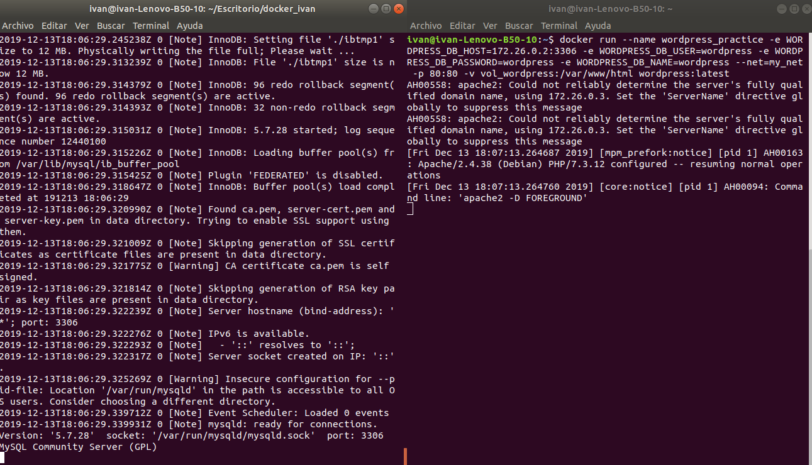

Al acceder a localhost podremos ver la pagina de instalación de wordpress

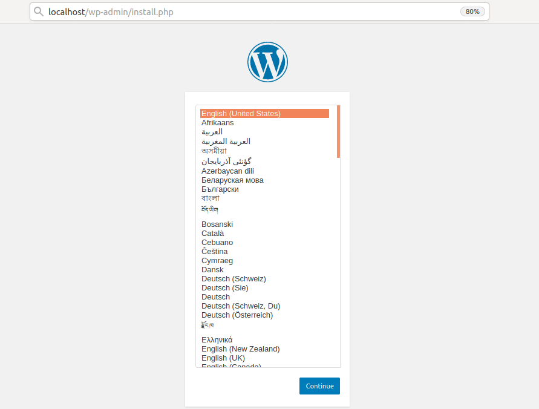

Configuramos la cuenta y podremos acceder tanto a la pagina como al panel de administración

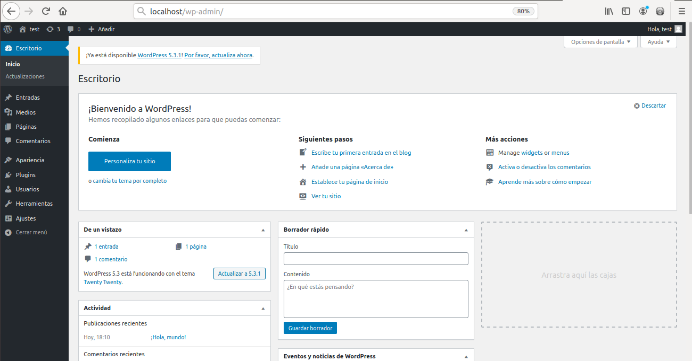
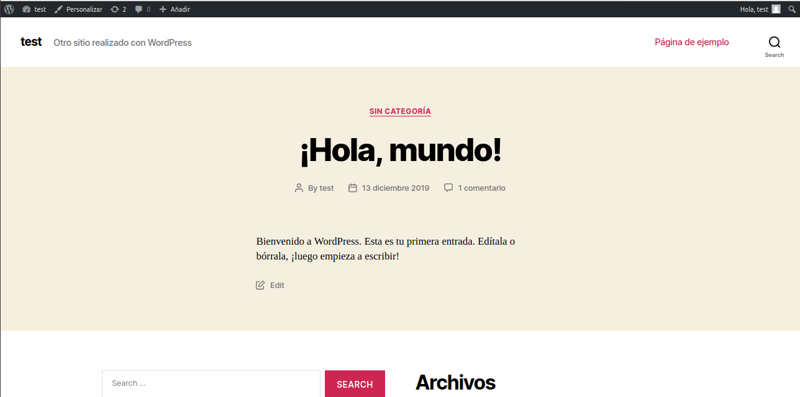

Finalmente vamos a comprobar que la información se esta guardando correctamente asi que vamos a apagar los 2 contendores.
El de wordpress de puede apagar con ctrl + c
El de MySQl hay que apagarlo con el comando:
```bash 
docker stop mysq_practice
```
Ahora limpiamos el ordenador de los containers antiguos con:

```bash
docker rm mysql_practice
docker rm wordpress_practice
```

Finalmente volvemos a crear los contedores con el comando mostrado anteriormete y al entrar a localhost

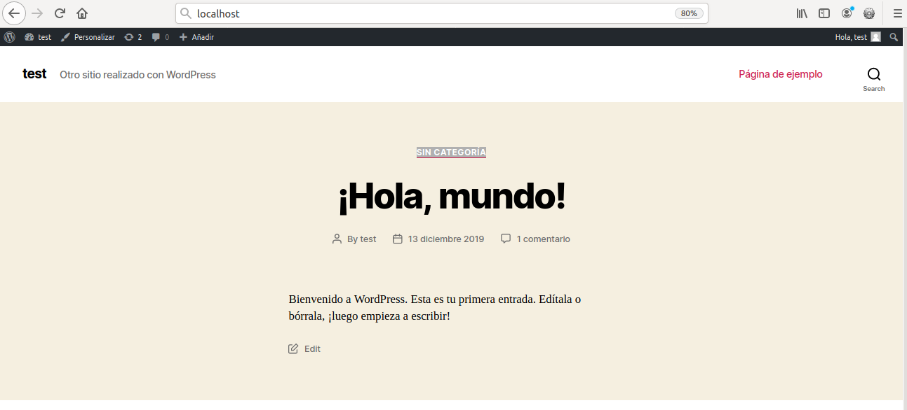

Veremos directamente la pagina que habiamos creado sin pasar por la instalación asi que los datos se estan guardando correctamente en los volumenes

## Apache

### Archivos

Vamos a crear 4 archivos

000-default.conf: Este sera el archivo de configuración de site en apache. Se usa 000-default.conf para ahorrarnos tener que hacer el enlace simbolico

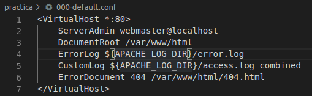

404.html: Pagina de error de la pagina que vamos a mostrar con apache

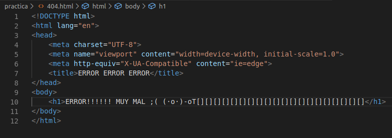

index.html: Index de la pagina de apache

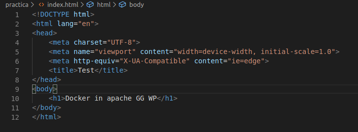

Finalmente el mas importante Dockerfile:

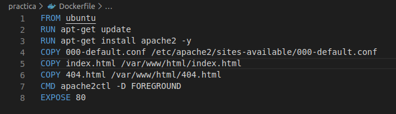

### Dockerfile

FROM ubuntu
Indicamos que vamos a usar la imagen de ubuntu

RUN apt-get update
Ejecutamos un update para bajarnos los paquetes correctamente

RUN apt-get install apache2 -y 
Instalamos apache

COPY 000-default.conf /etc/apache2/sites-available/000-default.conf
Copiamos el 000-default.conf a el site de apache

COPY index.html /var/www/html/index.html
Copiamos el index.html para que se muestre al ejecutar el apache

COPY 404.html /var/www/html/404.html
Copiamos el 404.html para mostrarlo en caso de error

CMD apache2ctl -D FOREGROUND
Ejecutamos el apache cuando se cree el contenedor el FOREGROUND se indica ya que si se ejecuta en background el contendor se cerraria

EXPOSE 80
Exponemos el puerto 80

### Contenedor

Antes de nada vamos a crear un archivo donde pasaremos los logs del contendor

```bash
mkdir dockerlog
```
Ejecutamos el 
```bash
docker build .
```

Finalmente realizamos el run

```bash
docker run -v /home/ivan/dockerlog:/var/log/apache2/ -p 80:80 8ed3989330c0
```
- -v: Indicamos el volumen en este caso guardaremos los archivos de /var/log/apache2 en /home/ivan/dockerlog
- -p: Enrutamos el puerto 80
- Finalmente ponemos el id de la imagen que se ha creado

Ahora podremos acceder a locahost para ver index.html

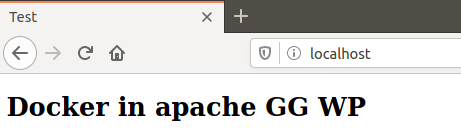

Podremos ver la pagina de error

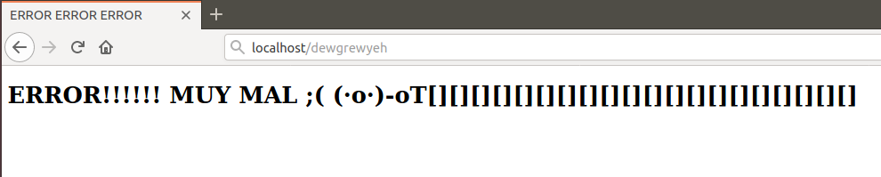

Y si vamos a la carpeta /home/ivan/dockerlog veremos los logs

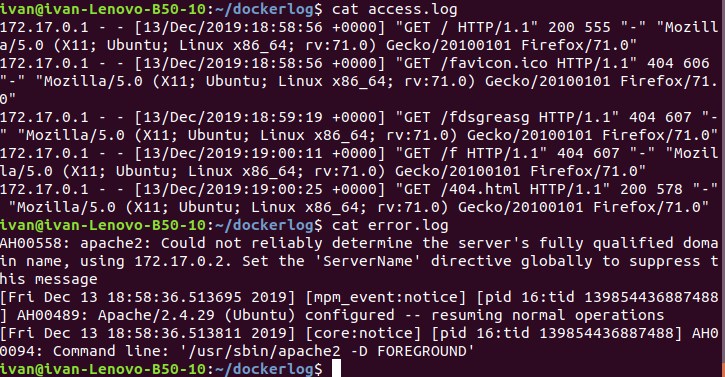